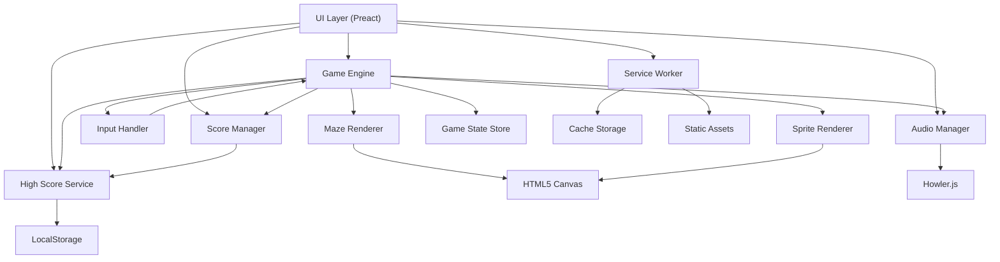

# Architect Mission Report

**Agent**: architect  
**Generated**: 2026-08-09T11:02:33.572Z

---

## Architecture Style

Modular Monolith (single‑page web app with clearly separated runtime modules)

## Components

- **UI Layer** (frontend): Root Preact application that renders menus, HUD, and hosts the canvas element for the game.
- **Game Engine** (frontend): Core loop that updates game state at 60 fps, coordinates rendering, physics and game rules.
- **Input Handler** (frontend): Normalises keyboard, WASD, swipe and on‑screen button events into direction commands for the engine.
- **Maze Renderer** (frontend): Draws static maze walls, dots and power pellets onto an HTML5 Canvas.
- **Sprite Renderer** (frontend): Renders animated Pac‑Man, ghosts, fruit and UI sprites each frame.
- **Audio Manager** (frontend): Plays background music and sound‑effects, supports mute/unmute and dynamic pitch changes.
- **Score Manager** (frontend): Tracks current score, lives, level, combo points and forwards high‑score updates.
- **High Score Service** (frontend): Persists top‑10 scores between sessions using browser LocalStorage.
- **Game State Store** (frontend): In‑memory representation of maze layout, dot map, ghost states and timers; serialisable for pause/resume.
- **Service Worker** (frontend): Caches static assets (JS, CSS, images, audio) on first load to enable offline play.

## Tech Stack

- **Frontend Framework**: Preact — Preact offers the same component model as React with a ~3 KB gzipped runtime, keeping the total bundle under the 2 MB limit. Vue adds a larger runtime and a different ecosystem, while full React would increase bundle size without measurable benefit for this simple game.
- **Language**: TypeScript — TypeScript gives static typing which reduces bugs in the complex AI and physics logic, while compiling to plain JS for browser compatibility. Plain JavaScript lacks compile‑time safety, and Elm would require a full compile pipeline and a different UI paradigm, adding unnecessary overhead.
- **Build Tool**: Vite — Vite provides lightning‑fast dev server start‑up and native ES module support, producing minimal bundle size. Webpack can achieve similar size but has slower config and build times; Parcel is zero‑config but produces larger bundles and less fine‑grained control.
- **State Management**: Redux Toolkit (RTK) with Immer — RTK gives a predictable, testable store with minimal boilerplate and built‑in devtools, useful for the many timers and entity states. Context is fine for small apps but becomes cumbersome with frequent updates (60 fps). MobX adds a runtime proxy layer that increases bundle size and can be harder to reason about for deterministic game logic.
- **Rendering**: HTML5 Canvas API — Canvas is the classic choice for 2D pixel‑perfect games, offering high performance at 60 fps with low memory overhead. SVG is vector‑based and slower for per‑frame pixel updates. WebGL is overkill for a simple 2D maze and would increase bundle size.
- **Audio**: Howler.js — Howler abstracts cross‑browser quirks, supports sprite‑based sound effects, and provides simple mute/volume controls. Direct Web Audio requires more boilerplate and handling of mobile unlock gestures. Tone.js is oriented toward music synthesis and adds unnecessary weight.
- **Persistence**: Browser LocalStorage — High scores are tiny (10 records) and fit comfortably in LocalStorage with a simple key/value API. IndexedDB adds async complexity for no benefit. Cache API is meant for assets, not structured data.
- **Offline Support**: Workbox (generated Service Worker) — Workbox automates precaching, cache versioning and fallback handling with a tiny configuration, ensuring reliable offline play. Writing a custom SW is error‑prone; omitting offline support would violate the requirement.
- **Testing**: Jest + @testing-library/preact — Jest provides fast unit test execution with built‑in mocking; @testing-library/preact gives DOM‑like queries for component testing. Mocha lacks built‑in coverage and snapshot features. Cypress is great for end‑to‑end but overkill for unit‑level game‑logic tests.
- **CI/CD**: GitHub Actions — GitHub Actions integrates directly with the repository, offers free minutes for open‑source, and can run lint, test, and build steps. GitLab CI would require a separate runner; CircleCI adds external service complexity.

## Epics

- **E1** Start Screen & Navigation: Display title screen, high‑score list, and allow the player to start a new game, toggle sound, and switch to color‑blind mode using keyboard or touch.
- **E2** Core Gameplay Loop: Run the 60 fps game loop, update positions, handle collisions, and render the maze, Pac‑Man, ghosts and fruit.
- **E3** Input Handling: Capture keyboard, WASD, swipe gestures and on‑screen buttons, translate them into direction commands, and feed them to the engine.
- **E4** Ghost AI & State Machine: Implement each ghost’s personality (chase, scatter, frightened, eyes) with timers and path‑selection logic.
- **E5** Scoring, Lives & Level Progression: Track points for dots, pellets, ghosts, fruit; manage lives, extra‑life threshold, level completion and difficulty scaling.
- **E6** Bonus Fruit System: Spawn fruit at the correct dot counts, display appropriate sprite, award points, and remove it after timeout.
- **E7** Audio Subsystem: Play background siren, sound effects for dots, pellets, ghost eating, death, fruit, extra life and support mute toggle.
- **E8** High Score Persistence: Save top‑10 scores with player initials to LocalStorage and load them on app start; allow entry of initials after Game Over.
- **E9** Offline‑First Capability: Cache all static assets (JS, CSS, images, audio) on first load so the game can be launched without network connectivity.
- **E10** Responsive & Accessible UI: Ensure layout adapts from phones to widescreen monitors, provide focus indicators, keyboard‑only navigation, and a color‑blind palette switch.

## Architecture Diagram

