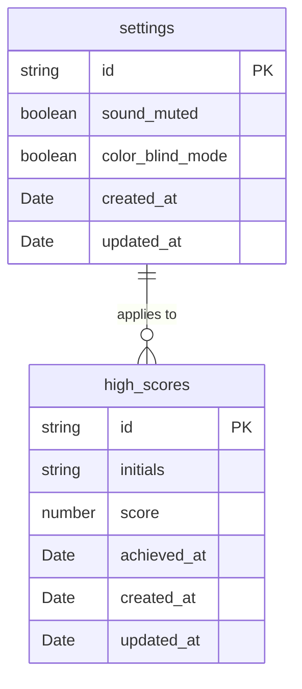

# DBA Mission Report

**Agent**: dba  
**Generated**: 2026-08-09T11:03:24.436Z

---

## Database Engine: IndexedDB (via Dexie.js)

The application is a pure frontend SPA that must work offline and persist only a tiny amount of data (high scores and user settings). IndexedDB is built into all modern browsers, works without any server component, and integrates nicely with Dexie.js which provides a simple, promise‑based API and schema versioning. This choice respects the existing tech stack (TypeScript, Vite, Preact) and avoids adding a backend dependency while still allowing indexed queries for the top‑10 scores.

## Entities (2)

- **high_scores**: 6 columns
- **settings**: 5 columns

## ERD

